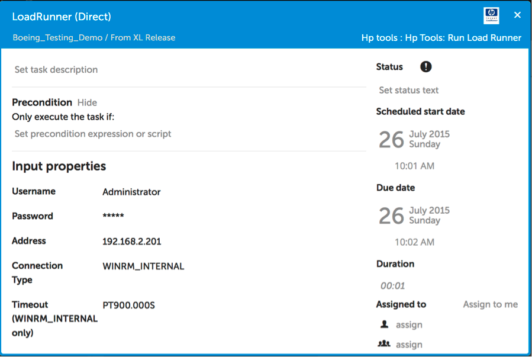

*** XL Release HP LoadRunner Plugin ***

**Introduction:**
This plugin will allow you to execute HP LoadRunner scenarios from XL Release.  A report with the test results will be returned to XL Release.

**Installation:**
Copy the plugin file to the XL Release plugin folder and restart the XL Release server. 

**Configuring an Example Template:**i
The Load Runner plugin provides one new task (Hp Tools: Run Load Runner).  You can add this step to you release template.

You can configure this task as follows:

The first few properties (Username, Password, Address, Connection Type and Timeout) are for configuring the connection to the remote host where QTP or UFT is installed.

 

Then we can configure the Test Path to point to the directory on the remote host where the test configuration is.  You can also configure the timeouts.  You should take care to make sure that you choose your timeouts wisely to ensure that the tests or the connection to the remote host don’t timeout before the load test is complete.

 

Once the release has been started and the Run QTP task is executing you can verify the test are running by looking for the UFT process in the Windows Task Manager as follows:
 

If the tests execute quickly you may not see the processes.  In any event since the tests are not automated via XL Release there is no need for a Window to display the progress of the tests.  Once the QTP step of the release has been completed the results of the test will be available in the output of the XL Release task as follows:

 

It this example we have 2 tests, one failed and the other succeeded.
 

 
 **Notice**

 
 This plugin uses parts of the Jenkins plugin hp-application-automation-tools-plugin to execute tests on a Load Runner server.  Details about the Jenkins plugin can be found at [JENKINS/HP+Application+Automation+Tools](https://wiki.jenkins-ci.org/display/JENKINS/HP+Application+Automation+Tools)

 
 The copywrite notice for the Jenkins components (i.e. HpToolsLauncher.exe) is as follows:


(c) Copyright 2012 Hewlett-Packard Development Company, L.P. 
Permission is hereby granted, free of charge, to any person obtaining a copy of this software and associated documentation files (the "Software"), to deal in the Software without restriction, including without limitation the rights to use, copy, modify, merge, publish, distribute, sublicense, and/or sell copies of the Software, and to permit persons to whom the Software is furnished to do so, subject to the following conditions:

The above copyright notice and this permission notice shall be included in all copies or substantial portions of the Software.

THE SOFTWARE IS PROVIDED "AS IS", WITHOUT WARRANTY OF ANY KIND, EXPRESS OR IMPLIED, INCLUDING BUT NOT LIMITED TO THE WARRANTIES OF MERCHANTABILITY, FITNESS FOR A PARTICULAR PURPOSE AND NONINFRINGEMENT. IN NO EVENT SHALL THE AUTHORS OR COPYRIGHT HOLDERS BE LIABLE FOR ANY CLAIM, DAMAGES OR OTHER LIABILITY, WHETHER IN AN ACTION OF CONTRACT, TORT OR OTHERWISE, ARISING FROM, OUT OF OR IN CONNECTION WITH THE SOFTWARE OR THE USE OR OTHER DEALINGS IN THE SOFTWARE.

